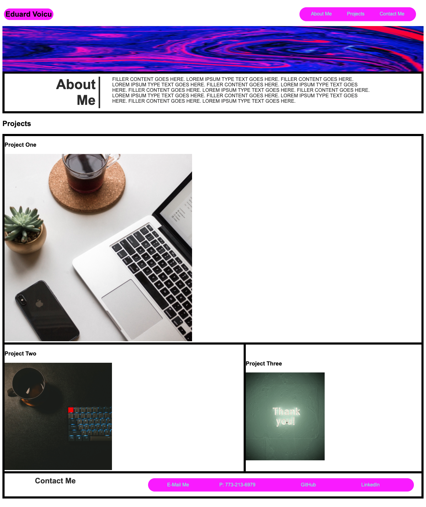

# Professional Portofolio Phase 1
by Eduard Voicu

## User Story
```
AS AN employer
I WANT to view a potential employee's deployed portfolio of work samples
SO THAT I can review samples of their work and assess whether they're a good candidate for an open position
```

```
This deployed app allows the user to learn about the developer, current and past projects deployed so that they can
make an informed decision on future employee recruitment. It also allows the user to get in contact with the developer with
a one click e-mail extension.
```
## Screenshot of App

## Links
[Github Repo](https://github.com/eduardvoicu/portofolio)
[Deployed Website](https://eduardvoicu.github.io/portofolio/)

